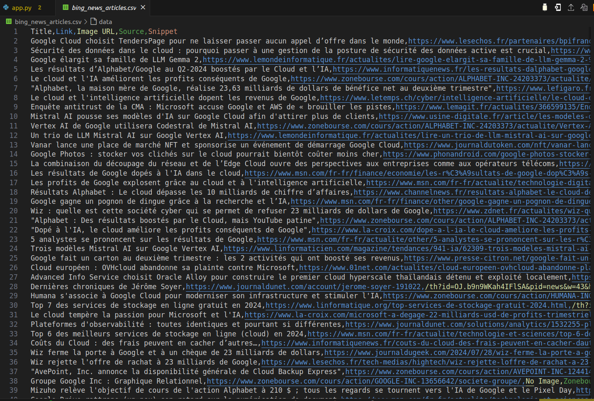

# search-news-on-bing-and-scrape-with-playwright

# Bing News Scraper with Playwright and Beautiful Soup

## Overview
Welcome to the Bing News Scraper, a Python script designed to extract news articles from Bing News search results. This script uses Playwright and BeautifulSoup to navigate the Bing News website, scroll through search results, and save the extracted data to a CSV file for further analysis.

## Features
- **Automated News Extraction**: Automatically scrapes news articles related to a specific search query from Bing News.
- **Infinite Scrolling Handling**: Efficiently scrolls through search results pages to load and capture all available content.
- **Data Extraction**: Extracts key information including titles, links, image URLs, sources, and snippets from each article.
- **CSV Output**: Saves the extracted data to a CSV file for easy access and further processing.

## Requirements
To run the Bing News Scraper, you'll need:
- Python 3.x
- Playwright
- BeautifulSoup
- CSV

## Installation
1. Clone the repository to your local machine.
2. Install the required dependencies:
   `pip install playwright beautifulsoup4`

## Usage
1. Run the script with `python scraper.py`.
2. The script will launch a browser, navigate to the Bing News search page, and start scrolling to load more content.
3. Once the scraping is complete, the data will be saved to `bing_news_articles.csv` in the current directory.
4. Review the CSV file for extracted article details.

## Contributing
We welcome contributions to improve the Bing News Scraper! Feel free to fork the repository, make enhancements, and submit a pull request.

### **Contributors**
- [Gabin H. VEGLO](https://github.com/VEGLOgabin/)

### **License**
This project is licensed under the **MIT License**.
